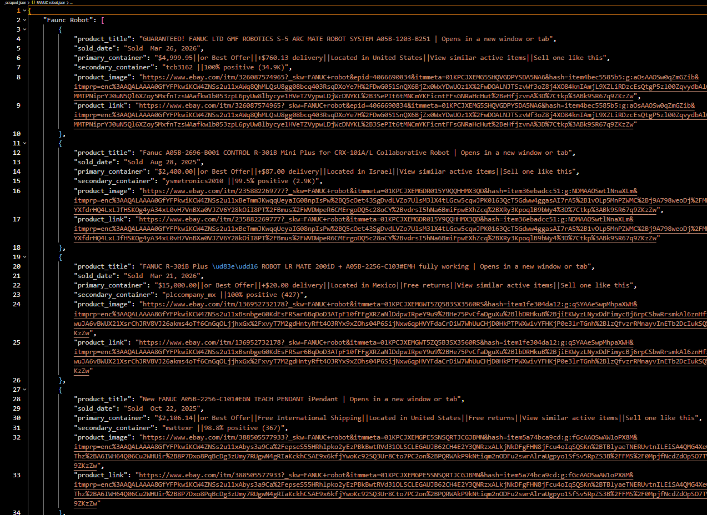

# Web Scraping : Scraping product data from e-Bay Website

### This is one of my advanced web-scraping projects, which required a lot of time, critical thinking, and optimized Python browser automation code to perform human-like browsing. It involved handling bans, rendering JavaScript content, parsing messy HTML, and storing data in JSON format. I then loaded the JSON data back into Python to apply transformations for cleaning. After that, I appended all scattered data into a single pandas DataFrame, created additional columns from messy text fields, assigned proper data types to each column, and finally saved everything in a clean Excel format.

## To Complete this project i used
* `Python`
* `Playwright` - Browser Automation 
* `Selenium` - Alternative option (though Playwright performed better) 
* `BeautifulSoup` - HTML parsing 
* `Pandas` - Data transformation and cleaning 
* `Excel` - Saving the final cleaned data

## **Project Source** : I got  this project from Upwork 

## **Data Source** : Data was available in the website like this

## **Data Container** : Data inside row HTML was look like this 

## **Json Formated Data** : After parsing HTML using Beautifulsoup

## **Data Cleaning & Transformation** : I used Python, Regex & Pandas to clean it

## **Final Dataset** : After applying transformation and cleaning

## **Final Output** : Deliverable clean excel data

## Thanks for exploring My Project

---- Success never have any shortcut --------
----- Hard Work and Consitency is the Key--------
----- Passion and Love in work leands toward sucess---------