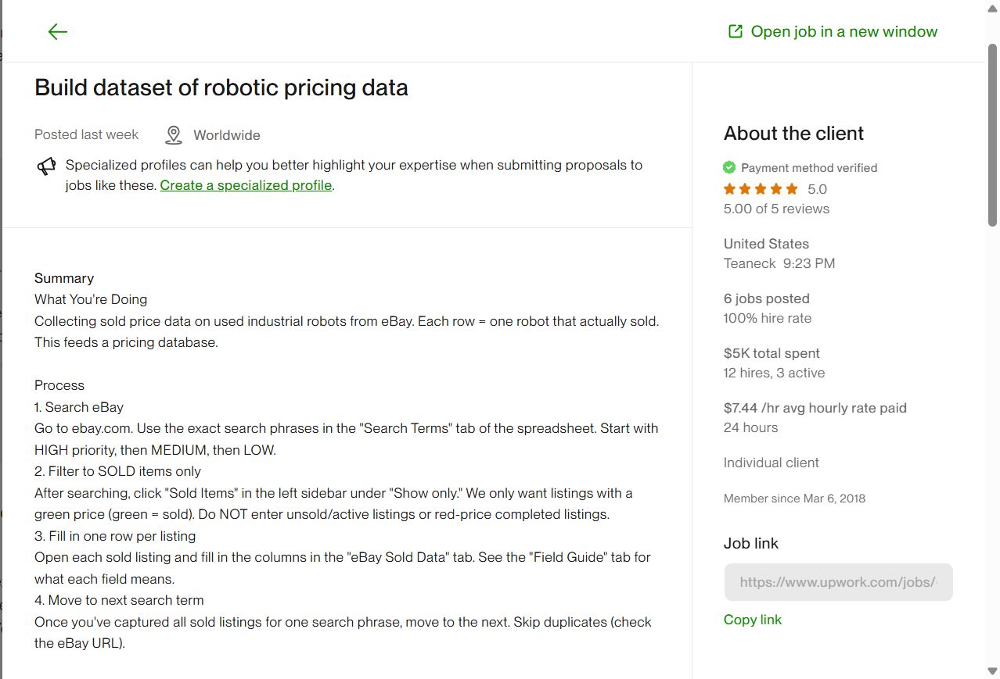
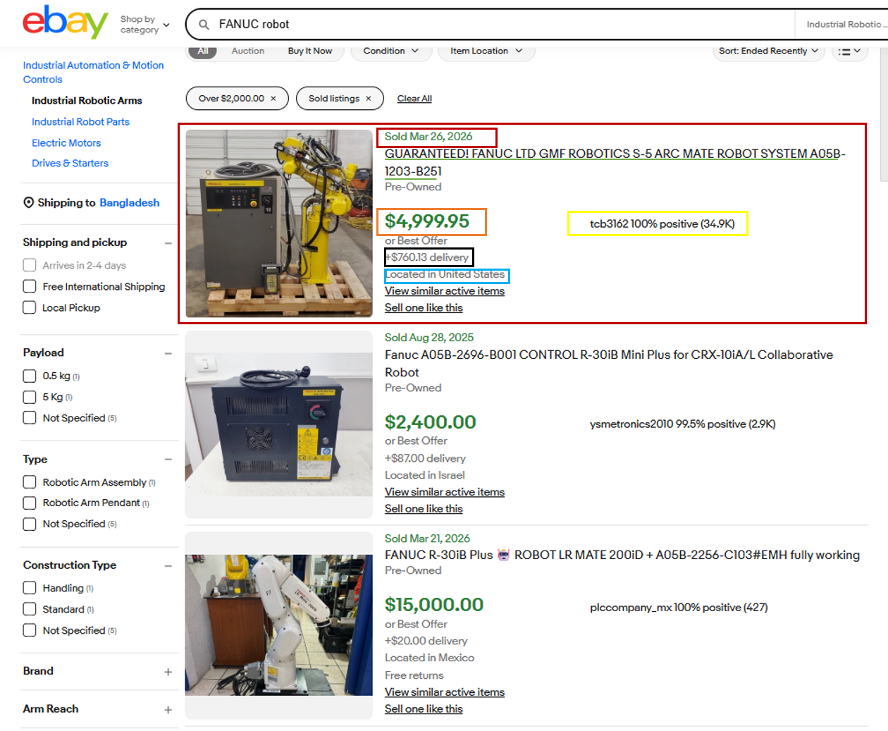
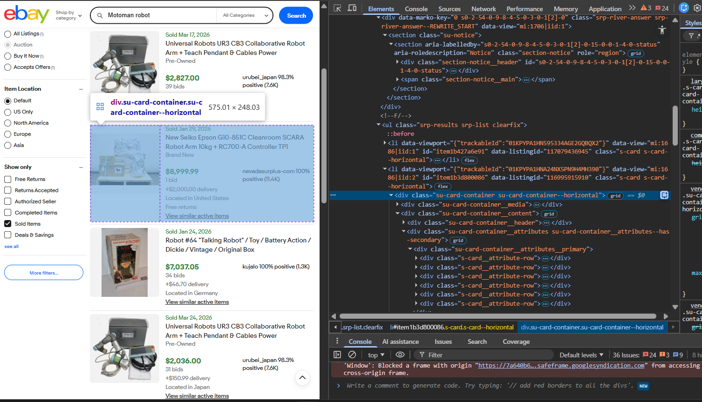
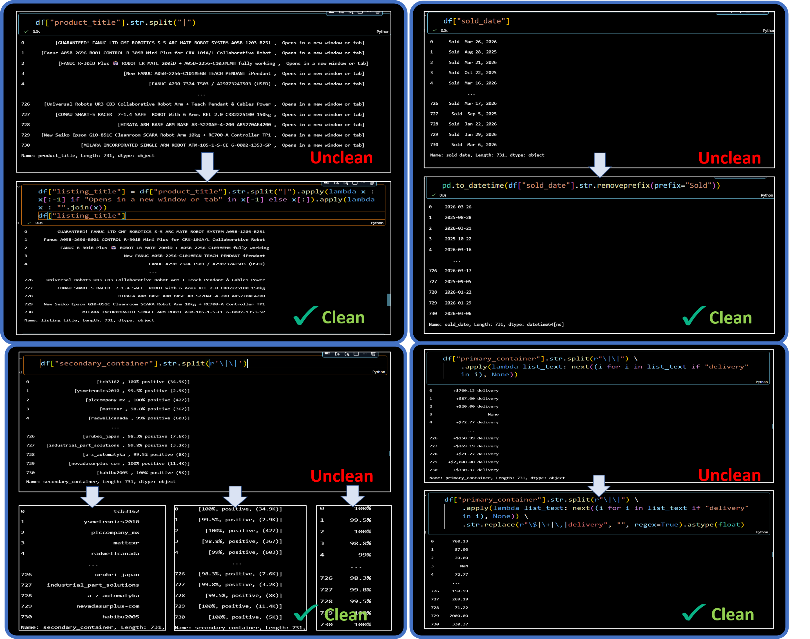
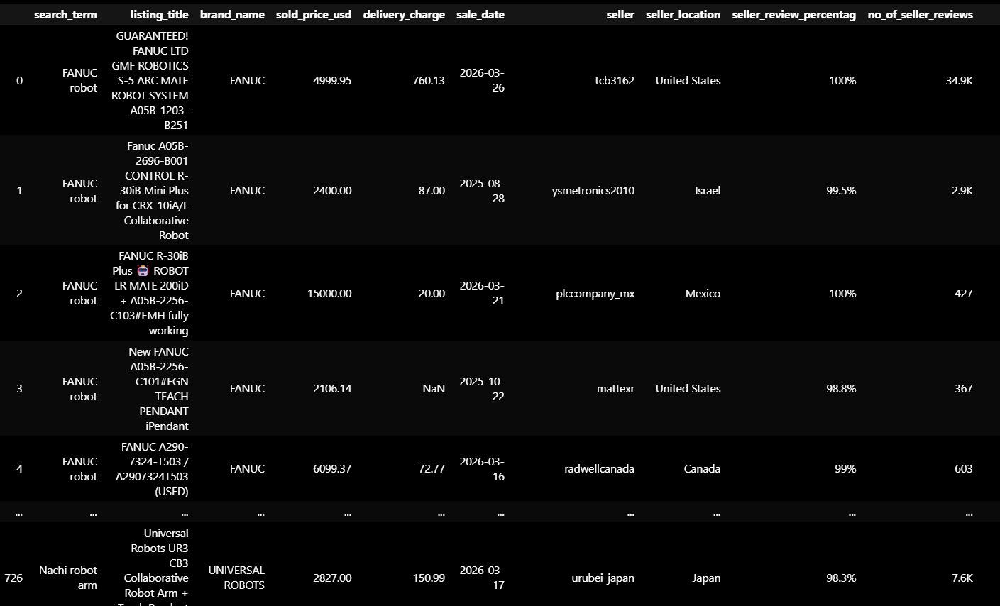
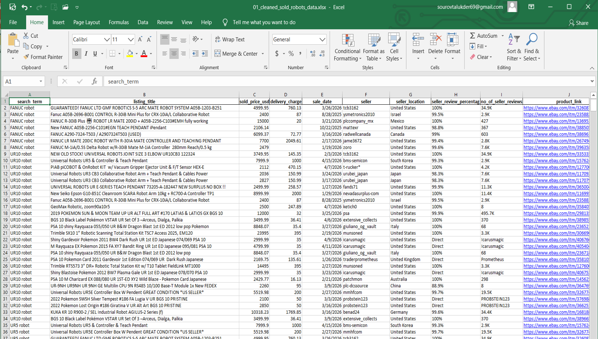

# Web Scraping : Scraping product data from e-Bay Website

### This is one of my advanced web-scraping projects, which required a lot of time, critical thinking, and optimized Python browser automation code to perform human-like browsing. It involved handling bans, rendering JavaScript content, parsing messy HTML, and storing data in JSON format. I then loaded the JSON data back into Python to apply transformations for cleaning. After that, I appended all scattered data into a single pandas DataFrame, created additional columns from messy text fields, assigned proper data types to each column, and finally saved everything in a clean Excel format.

## To Complete this project i used
* `Python`
* `Playwright` - Browser Automation 
* `Selenium` - Alternative option (though Playwright performed better) 
* `BeautifulSoup` - HTML parsing 
* `Pandas` - Data transformation and cleaning 
* `Excel` - Saving the final cleaned data

## **Project Source**  
I got this project from Upwork.  

  

---

## **Data Source**  
The data was available on the website in the following format:  

  

---

## **Data Container**  
The data inside each HTML row looked like this:  

  

---

## **JSON Formatted Data**  
After parsing the HTML using BeautifulSoup:  

  

---

## **Data Cleaning & Transformation**  
I used Python, Regex, and Pandas to clean and transform the data:  

  

---

## **Final Dataset**  
After applying all transformations and cleaning:  

  

---

## **Final Output**  
Deliverable: clean Excel data  

  

---

## **Thanks for Exploring My Project☺️**

**Success never has any shortcuts**  
**Hard work and consistency are the keys**  
**Passion and love for your work leads to success**

